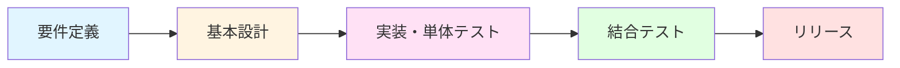

# プロジェクトの進め方

## 開発フロー

通常のプロジェクトと同様に、以下の順序で進めます。



## Git作業手順

### 1. 初回セットアップ(初回のみ)

```bash
# リモートリポジトリをローカルにクローン
git clone <リポジトリURL>
cd proj-1sys-ax-2025
```

### 2. 機能開発の流れ

#### 2.1 ブランチの作成

```bash
# 最新のmainブランチを取得
git checkout main
git pull origin main

# 作業用ブランチを作成
git checkout -b feature/<機能名>
# 例: git checkout -b feature/user-authentication
```

**ブランチ命名規則:**
- `feature/<機能名>`: 新機能開発
- `fix/<修正内容>`: バグ修正
- `docs/<ドキュメント名>`: ドキュメント更新
- `refactor/<対象>`: リファクタリング

#### 2.2 ファイルの作成・編集

開発作業を行い、変更をステージングに追加します。

```bash
# 特定のファイルを追加
git add <ファイルパス>

# 全ての変更を追加(慎重に使用)
git add .

# ステージング状態を確認
git status
```

#### 2.3 コミット

```bash
# 変更をコミット
git commit -m "コミットメッセージ"

# コミット履歴を確認
git log --oneline
```

**コミットメッセージのガイドライン:**
- 簡潔で分かりやすい内容にする
- 何を変更したか(What)と、なぜ変更したか(Why)を記載
- 例: `ユーザー認証機能を追加` `ログイン時のバリデーションエラーを修正`

#### 2.4 リモートへのプッシュ

```bash
# リモートリポジトリにプッシュ
git push origin <ブランチ名>

# 初回プッシュ時(上流ブランチを設定)
git push -u origin <ブランチ名>
```

### 3. プルリクエスト(PR)作成

リモートにプッシュ後、GitHubでPRを作成します。

#### 3.1 PRの作成手順

1. GitHubのリポジトリページにアクセス
2. 「Pull requests」タブをクリック
3. 「New pull request」ボタンをクリック
4. ベースブランチ(`main`)とマージ元ブランチ(自分のブランチ)を選択
5. PR内容を記載:
   - **タイトル**: 変更内容を簡潔に記載
   - **説明**: 変更の詳細、理由、影響範囲などを記載
6. レビューワーを指定

#### 3.2 レビューワーの指定ルール

- **基本ルール**: 自分以外のチームメンバーをレビューワーに指定
- **澤田さんの場合**: 西澤さんと南雲さんを指定
- レビューワーは最低1名、可能であれば2名以上が推奨

### 4. コードレビュー

#### 4.1 レビュアーの作業

PRを受け取ったメンバーは以下を実施します。

1. **変更内容の確認**
   - コードの品質、可読性
   - バグや問題がないか
   - 設計方針に沿っているか
   - テストが適切か

2. **コメントの記入**
   - 改善提案や質問をコメントとして記載
   - 具体的で建設的なフィードバックを心がける

3. **判断の入力**
   - `Approve`: 問題なし、マージ可能
   - `Request changes`: 修正が必要
   - `Comment`: コメントのみ(判断保留)

#### 4.2 レビュー指摘への対応

修正依頼があった場合:

```bash
# ファイルを修正
# ...

# 修正をコミット
git add <修正ファイル>
git commit -m "レビュー指摘に対応: <修正内容>"
git push origin <ブランチ名>
```

### 5. マージ

全てのレビューワーの承認が得られたら、マージを実施します。

- **マージ実施者**: 最後に`Approve`した人
- **マージ方法**: GitHubのPRページから「Merge pull request」をクリック
- **マージ後**: ブランチを削除(リモート・ローカル両方)

```bash
# ローカルブランチの削除
git checkout main
git pull origin main
git branch -d <ブランチ名>

# リモートブランチの削除(GitHubで自動削除されない場合)
git push origin --delete <ブランチ名>
```

## トラブルシューティング

### コンフリクトが発生した場合

```bash
# mainブランチの最新を取得
git checkout main
git pull origin main

# 自分のブランチに戻る
git checkout <ブランチ名>

# mainの変更をマージ
git merge main

# コンフリクトを手動で解決
# コンフリクトファイルを編集

# 解決後、コミット
git add .
git commit -m "コンフリクトを解決"
git push origin <ブランチ名>
```

### 誤ってコミットした場合

```bash
# 直前のコミットを取り消し(変更は残る)
git reset --soft HEAD^

# 直前のコミットを完全に取り消し(変更も破棄)
git reset --hard HEAD^
```

## ベストプラクティス

1. **こまめにコミット**: 意味のある単位で小さくコミット
2. **プッシュ前に確認**: `git status`, `git diff`で変更内容を確認
3. **定期的にmainを取り込む**: コンフリクトを最小化
4. **レビューは迅速に**: PRは24時間以内にレビュー
5. **テストを実施**: コミット前に動作確認とテストを実施