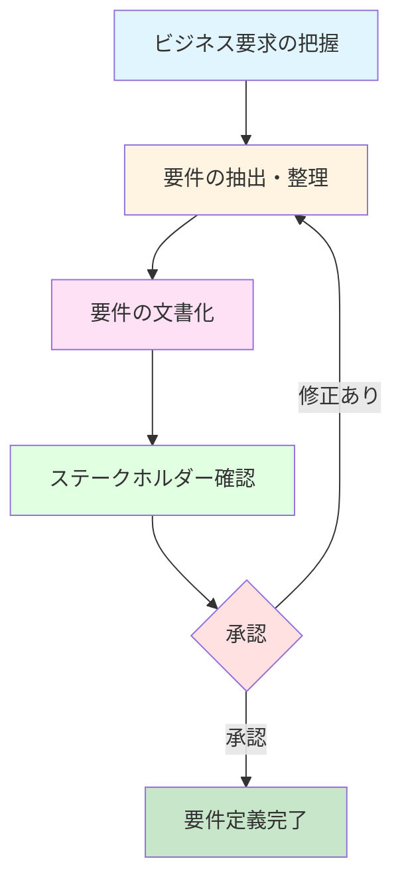
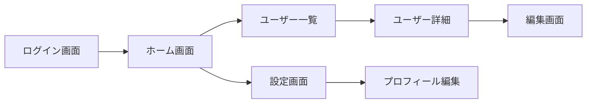
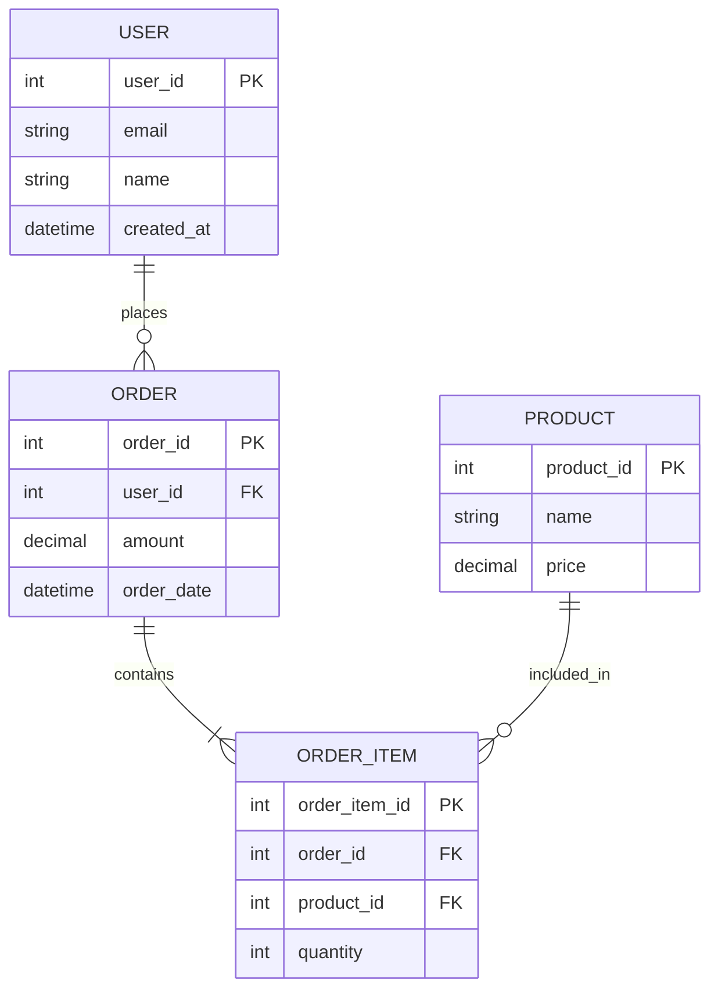

# 要件定義の進め方

## 要件定義の目的

要件定義は、システム開発の最初のフェーズであり、**「何を作るか」を明確にする**工程です。この段階で要件を正確に把握することで、後工程での手戻りを最小限に抑えることができます。



## 要件定義の成果物

要件定義フェーズで作成すべき主な成果物:

1. **要件定義書**: システム全体の要件をまとめた文書
2. **機能要件一覧**: 実装すべき機能の詳細リスト
3. **非機能要件一覧**: 性能、セキュリティ、運用要件など
4. **画面遷移図**: ユーザーインターフェースの流れ
5. **ER図(概念モデル)**: データの関係性を示す図
6. **ユースケース図**: システムの利用シーン
7. **業務フロー図**: 現状とTo-Beの業務プロセス

## 要件定義の進め方

### 1. ビジネス要求の把握

#### 1.1 ステークホルダーへのヒアリング

**実施事項:**
- プロジェクトオーナーや業務担当者との面談
- 現状の課題や問題点の洗い出し
- システム化の目的と期待効果の確認
- 優先順位の確認

**ヒアリング項目例:**
- 現在どのような業務を行っているか?
- どのような課題・問題があるか?
- システム化で何を実現したいか?
- 誰がそのシステムを使うか?
- いつまでに完成させる必要があるか?
- 予算や制約条件はあるか?

#### 1.2 現状分析

- 既存システムの調査(ある場合)
- 現行業務フローの把握
- データの流れと保管状況の確認
- 既存の問題点の可視化

### 2. 要件の抽出・整理

#### 2.1 機能要件の定義

システムが**「何をするか」**を定義します。

**記載項目:**
- 機能ID
- 機能名
- 機能概要
- 入力項目
- 出力項目
- 処理内容
- 優先度(必須/重要/任意)

**機能要件の例:**

| 機能ID | 機能名 | 概要 | 優先度 |
|--------|--------|------|--------|
| F001 | ユーザー登録 | 新規ユーザーの情報を登録する | 必須 |
| F002 | ユーザーログイン | メールアドレスとパスワードで認証する | 必須 |
| F003 | パスワードリセット | 忘れたパスワードを再設定する | 重要 |
| F004 | プロフィール編集 | ユーザー情報を更新する | 必須 |

#### 2.2 非機能要件の定義

システムの**品質や性能**に関する要件を定義します。

**主な非機能要件:**

1. **性能要件**
   - 応答時間: 画面表示は3秒以内
   - 処理速度: バッチ処理は1時間以内に完了
   - 同時接続数: 最大1,000ユーザーの同時アクセスに対応

2. **セキュリティ要件**
   - 認証方式: OAuth 2.0を使用
   - データ暗号化: パスワードはハッシュ化して保存
   - アクセス制御: ロールベースのアクセス制御(RBAC)

3. **可用性要件**
   - 稼働率: 99.9%以上
   - ダウンタイム: 月次メンテナンスは2時間以内
   - バックアップ: 毎日自動バックアップを実施

4. **運用・保守要件**
   - ログ保存期間: 1年間
   - 監視体制: 24時間365日の監視
   - サポート対応: 平日9:00-18:00

5. **互換性要件**
   - 対応ブラウザ: Chrome, Firefox, Edge, Safari(最新版)
   - 対応デバイス: PC, タブレット, スマートフォン

#### 2.3 制約条件の明確化

プロジェクトの制約を文書化します。

- **スケジュール制約**: リリース期限、マイルストーン
- **予算制約**: 開発予算、運用コスト
- **技術制約**: 使用する技術スタック、既存システムとの連携
- **法的制約**: 個人情報保護法、業界規制

### 3. 要件の文書化

#### 3.1 要件定義書の作成

**要件定義書の構成例:**

```
1. プロジェクト概要
   1.1 背景と目的
   1.2 スコープ
   1.3 用語定義

2. システム概要
   2.1 システム構成図
   2.2 利用者
   2.3 システム境界

3. 機能要件
   3.1 機能一覧
   3.2 機能詳細
   3.3 画面遷移図
   3.4 データ項目定義

4. 非機能要件
   4.1 性能要件
   4.2 セキュリティ要件
   4.3 可用性要件
   4.4 運用・保守要件

5. 制約条件
   5.1 スケジュール
   5.2 予算
   5.3 技術制約

6. 前提条件・リスク

7. 承認
```

#### 3.2 図表の作成

**画面遷移図:**


**ER図(例):**


### 4. ステークホルダーとの確認・調整

#### 4.1 レビュー会議の実施

**準備事項:**
- 要件定義書の事前配布
- レビュー観点の明示
- 質問事項の事前収集

**レビュー観点:**
- 要件の漏れはないか?
- 要件の解釈に誤りはないか?
- 実現可能性は問題ないか?
- 優先順位は適切か?
- スケジュールは妥当か?

#### 4.2 フィードバックの反映

- レビューで得られた指摘事項を整理
- 修正内容を文書に反映
- 再度レビューが必要な場合は、レビュー会議を再設定

#### 4.3 承認取得

- 最終版の要件定義書を提出
- ステークホルダーから正式な承認を取得
- 承認記録を残す(承認印、電子署名など)

### 5. 基本設計への引き継ぎ

要件定義が完了したら、次フェーズへの引き継ぎを行います。

**引き継ぎ事項:**
- 要件定義書と関連資料の共有
- 設計チームへの説明会実施
- 質疑応答セッションの設定
- 要件の優先順位と制約条件の再確認

## 要件定義の成功ポイント

### チェックリスト

- [ ] ステークホルダーへのヒアリングは十分に実施したか?
- [ ] 機能要件は具体的で実装可能か?
- [ ] 非機能要件は定量的に定義されているか?
- [ ] 画面イメージやフロー図は分かりやすいか?
- [ ] 制約条件やリスクは明確になっているか?
- [ ] ステークホルダーの承認は得られたか?
- [ ] 次フェーズへの引き継ぎ準備は整ったか?

### ベストプラクティス

1. **早期にプロトタイプを作成**: 画面モックアップやワイヤーフレームで認識を合わせる
2. **定期的なコミュニケーション**: 週次ミーティングで進捗と課題を共有
3. **要件の優先順位付け**: MoSCoW法(Must/Should/Could/Won't)で優先度を明確化
4. **変更管理プロセスの確立**: 要件変更時の手続きを明確にする
5. **ドキュメントのバージョン管理**: Gitで要件定義書を管理し、変更履歴を追跡

### よくある失敗パターンと対策

| 失敗パターン | 原因 | 対策 |
|------------|------|------|
| 要件の漏れ | ヒアリング不足 | チェックリストを使った網羅的なヒアリング |
| 要件の曖昧さ | 抽象的な表現 | 具体例や画面イメージで可視化 |
| スコープクリープ | 要件の無制限な追加 | 変更管理プロセスの確立と優先順位付け |
| ステークホルダーの不一致 | コミュニケーション不足 | 定期的なレビュー会議の実施 |

## 参考資料

- プロジェクトの進め方: [01_プロジェクトの進め方.md](./01_プロジェクトの進め方.md)
- 今回のプロジェクトでの要求事項 : [顧客要求事項.md](./03_顧客要求事項.md)
- AIを活用した作業手順の具体化手法 : [AIテクニック.md](./AIテクニック.md)