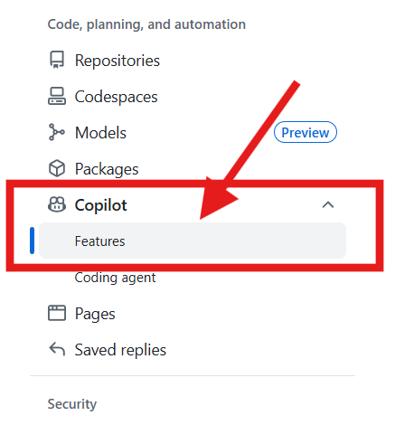
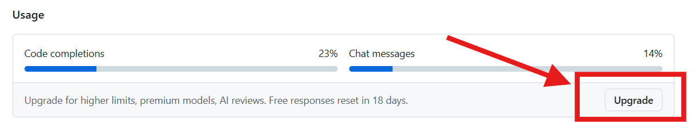
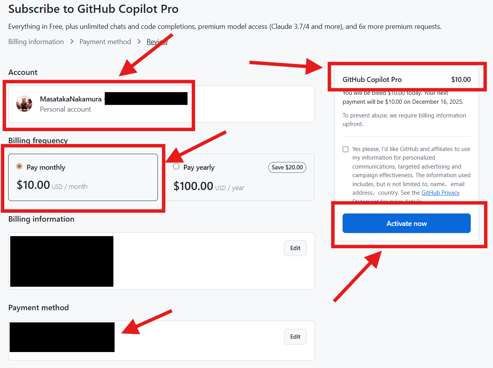
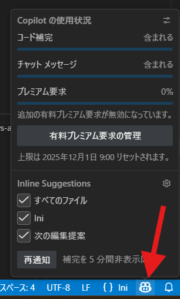
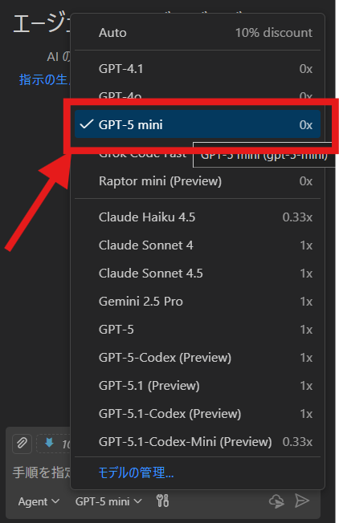

# Step1. 要件定義を作成してみよう ✍️

## 事前準備 ✅
1. VS Codeのインストール 💻
    - こちらの手順を参考にインストールしてください。
    - https://flash-llama-8c6.notion.site/1a3c1457be42802c97a6fe9a6eb959c8
2. Github Copilot の契約 🔐
    - https://github.com/　にアクセス
    - ログイン
        - 右上の`Sign in`をクリック
        - Githubアカウントでログイン
    - 右上のプロフィールアイコンをクリック
    - `Settings`をクリック
    - 左のメニューから`Copilot` - `features` をクリック
        - 
    - `Usage` の `Upgrade` ボタンをクリック
        - 
    - `Github Copilot Pro`プランの契約を完了する 🧾
        - 
        - Accoutが自身のアカウントであることを確認する
        - 課金サイクルを選択する（月額）
        - Payment methodにクレジットカード情報を入力する
        - 画面右側の契約内容が `Github Copilot Pro $10.00` であることを確認する
        - `Activate now` ボタンをクリックして契約を完了する
3. VS CodeでGithub Copilotを有効化 ⚙️
    - VS Codeを起動
    - 左のメニューから`Extensions`をクリック
    - 検索ボックスに`Github Copilot`と入力
    - `Github Copilot`拡張機能をインストール
    - インストール後、`Reload`ボタンをクリックしてVS Codeを再起動
    - 画面右下のGithub Copilotのアイコンをクリックし、`Sign in to GitHub Copilot`
        - 
    - ブラウザが起動するので、Githubアカウントでログイン

### Github Copilotの請求 🧾
- 契約が完了すると、毎月10ドルが請求されます。
- このプロジェクト中は、会社が負担します。
- 請求が発生した場合は、以下の情報を添えて、私までご連絡ください。
```
■ 提出方法
・請求が発生した後、領収書（PDF／画像可）をご提出ください。
・領収書の宛名：銀河ソフトウェア株式会社
・提出先：中村（SlackのDM または メール/m-nakamura@ginga.infoいずれも可）

■ 精算の流れ
・中村が提出いただいた領収書を取りまとめ、会社へ提出します。
・後日、銀河ソフトウェアから各個人の口座へ振込いたします。

■ 外貨（米ドル）建ての精算について
・米ドルでの支払いは、一定期間ごとに会社が指定する為替レートで円換算して精算します。
```

## このステップのゴール ✅
- AIを活用して、要件定義書を作成する
    - 完ぺきでなくてもOK
    - まずは、AIに要件定義を作成してもらうことを目指す
- `docs/00_personal/`配下の各自のフォルダに要件定義書を作成する
- レビューはメンバー全員で行う
- 最終的に皆さんが作成した要件定義書を統合して、プロジェクトの要件定義書とする
- ここで作成した要件定義書は、後の設計・実装フェーズで活用します。

## 要件定義の目的 🎯
- 何を作るのかを明確にする
- 開発の指針を決める
- スコープを管理する

## 要件定義の進め方 🛠️
1. ユーザーストーリーの作成
2. 機能要件の洗い出し
3. 非機能要件の洗い出し
4. 優先順位の設定
5. 要件のレビューと承認

## 具体的には？ 🔍
- ユーザーストーリーを作成し、ユーザーの視点からシステムの要件を明確にします。
- 各機能の詳細な要件を洗い出し、システムが満たすべき条件を定義します。
- パフォーマンス、セキュリティ、可用性などの非機能要件も考慮します。
- 各要件に優先順位を設定し、重要な要件から実装できるようにします。
- 最後に、関係者と要件をレビューし、承認を得ます。

## アドバイス 💡
- **「と言われても、最初は何から始めれば良いかわからないです。」** と思うのが普通です。
- そんな時こそ、AIの力を借りましょう。
- Github Copilotに以下のように質問してみましょう。
    ‐ 「最高の要件定義書ってどんなもの？」
    - 「要件定義って何をしたらいい？」
    - 「要件定義のテンプレートを教えて」
    - 「要件定義の良い例、悪い例を教えて」
    - 「要件定義の進め方を教えて」
    - 「要件定義の注意点を教えて」
    - 「顧客からヒアリングした内容を #03_顧客要求事項.md の形式でまとめたので、要件定義に落とし込んで、要件定義.mdファイルを作成して。」
    - 「要件定義に必要な図は、mermaid形式で作成して」
- 要件定義は一度で完璧にする必要はありません。
- プロジェクトの進行に伴い、要件は変化することもあります。
- 柔軟に対応し、必要に応じて要件を見直すことが重要です。
```
コラム:
AIがタスクに対する心理的ハードルを下げる要件定義のような大きなタスクや、
全く新しい企画書作成に直面したとき、
多くの人は「何から始めれば良いかわからない」と圧倒され、手が止まってしまいがちです。

これは特定の業務に限らず、
あらゆるタスクにおいて「何を、どの順番で、どこまでやれば良いのか」が見えないことによって生じる「心理的ハードル」と言えます。
この「最初の一歩を踏み出せない」という心理的なハードルを劇的に下げてくれるのが、
AIツールを活用する大きなメリットだと私は思います。

例えば、「何から始めればいいのか？」と漠然とした不安を抱えている状態でも、
AIに対して
「○○のための要件定義のたたき台を作って」
「企画書に必要な項目をリストアップして」
と指示するだけで、AIは瞬時に「60点の土台」を提示してくれます。
完璧なもの（100点）を最初から目指す必要はなく、
まずはAIが示した「たたき台」を修正・肉付けしていく形で作業を開始できるのです。
AIへの質問や指示を通じて、
「何をすべきか」
「どう進めるべきか」
「必要な情報は何か」
といった曖昧だったタスクが具体的なステップに分解されます。
これにより、「これなら自分にもできそうだ」という感覚が生まれ、
いままで躊躇していた複雑なタスクにも取り組みやすくなります。

AIは、私たちの思考を整理し、行動への抵抗を取り除いてくれる「触媒」のような存在です。
タスクの第一歩を踏み出すためのパートナーとして、AIを積極的に活用してみてはいかがでしょうか。
```

## 参考資料 📚
- [02_要件定義の進め方](02_要件定義の進め方.md)
- [03_顧客要求事項](03_顧客要求事項.md)
    - 今回のプロジェクト用に私（中村）が作成した顧客要求事項です。

## メモ 📝
- Github Copilot Chatを使用する際は、用途に合わせてモデルを切り替えてください。
    - 要件定義の作成には、`GPT-5mini`モデルを使用することをお勧めします。
        - 
    - 基本的には、 `GPT-5mini`モデルで問題ありませんが、より高度な要件定義が必要な場合は、
        - `GPT-5`
        - `Gemini 2.5 Pro`
        - `Claude Sonnet 4.5`
    - などの上位モデルを使用してみてください。
    - モデルによって回答の質がどのように変わるのか、試してみるのも良いでしょう。

## お願い 🙏
- Github Copilot Chatで `質問した内容` や `生成された回答` を極力保存してください。
- 最終的に、啓蒙活動で発表する際に、どのようにAIを活用したのかを示すための資料として使用したいと考えています。
    - Chatで壁打ちした内容を最終的に、「今までの内容をまとめて、ファイルに出力して」といった形で出力すればOKです。
    - 保存するのを忘れてしまった場合は無理に再度、同じ質問をする必要はありません。
- 疑問点や質問があれば、積極的にSlackで意見交換をしましょう。

## AI 活用のポイント 🤖
- [AIテクニック](AIテクニック.md)を参考に、AIを効果的に活用しましょう。
- 明確な指示を与える: AIに対して具体的で明確な指示を与えることで、より正確な回答が得られます。
- 反復的な対話: AIとの対話を繰り返し行い、回答を洗練させていくことが重要です。
- 検証と修正: AIの回答を鵜呑みにせず、必ず人間の目で検証し、必要に応じて修正を加えましょう。
- コンテキストの提供: AIに対して十分なコンテキストを提供することで、より適切な回答が得られます。
- フィードバックの活用: AIの回答に対してフィードバックを提供し、改善を促すことも有効です。
- 複数のモデルの活用: 必要に応じて異なるAIモデルを試し、最適な回答を得ることができます。
