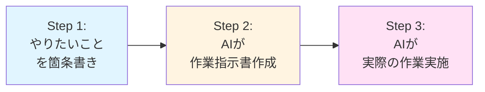

# AIテクニック

## 基本的なAI活用テクニック

### LLMモデルの使い分け

モデルは適宜変更しながら活用しましょう。

| 用途 | 推奨モデル | 理由 |
|------|----------|------|
| ドキュメント作成・壁打ち | `GPT-5 mini` | 軽量で高速、コスト効率が良い |
| コード生成 | `GPT-5 codex`、`Claude 4.5`、`Gemini 2.5` | コード生成に特化、高精度 |

**ポイント:**
- 各モデルの得意・不得意を把握し、適材適所で使い分ける
- コスト、速度、精度のバランスを考慮する

### わからないことはAIに質問する

**具体的な質問をすることで、的確な回答が得られやすくなります。**

**質問例:**
- 「要件定義を行う際のポイントは?」
- 「要件定義書を参照して、基本設計書を作成して」
- 「基本設計書を参照して、アーキテクチャ設計を作成して」
- 「Pythonでリストの要素をソートする方法は?」

**重要:**
- AIの回答を参考にしつつ、自分で調べたり試したりすることも重要
- 鵜呑みにせず、必ず検証する

### ドキュメント作成・コード生成の活用

**プロンプト例:**
- 「作業概要_20251104_001.mdを参照して、作業指示書を作成して。」
- 「作業指示書を参照して、記載されている作業を進めてだ下さい」

**注意点:**
- 生成されたドキュメントやコードは必ず自分で確認し、必要に応じて修正する
- 品質チェックを怠らない

### 段階的タスク管理手法(3ステップアプローチ)

複雑なタスクを効率的に進めるための、AIを活用した段階的な作業管理手法です。

#### 概要



#### Step 1: やりたいことを箇条書きで書き出す

まず、実現したいことを箇条書きでMarkdownファイルに整理します。

**作業概要_YYYYMMDD_001.md の例:**

```markdown
# 作業概要

## やりたいこと
- ユーザー認証機能を実装したい
- JWTを使った認証にしたい
- パスワードはbcryptでハッシュ化したい
- ログイン、ログアウト、トークンリフレッシュ機能が欲しい

## 技術スタック
- Node.js + Express
- TypeScript
- PostgreSQL

## 制約条件
- 既存のユーザーテーブルを使用する
- セキュリティのベストプラクティスに従う
- テストコードも併せて作成する

## 期限
- 2025年1月15日まで
```

**ポイント:**
- 思いついたことを気軽に書き出す
- 完璧である必要はない(AIが補完してくれる)
- 技術的な詳細よりも「何を実現したいか」に焦点を当てる
- 制約条件や期限も忘れずに記載

#### Step 2: AIに作業指示書を作成させる

作業概要ファイルをAIに渡し、具体的な作業手順書を作成してもらいます。

**プロンプト例:**
```
作業概要_20250104_001.mdを参照して、詳細な作業指示書を作成してください。
以下の項目を含めてください:
- 具体的な作業手順(チェックリスト形式)
- 各手順の詳細説明
- 必要なファイルとその配置
- テスト方法
- 完了条件
```

**生成される作業指示書の例:**

```markdown
# 作業指示書_20250104_001

## 作業概要
ユーザー認証機能をJWTとbcryptを使用して実装する

## 前提条件
- Node.js環境がセットアップ済み
- PostgreSQLが稼働中
- 既存のユーザーテーブルが存在する

## 作業手順

### 1. 環境セットアップ
- [ ] 必要なパッケージをインストール
  ```bash
  npm install jsonwebtoken bcryptjs
  npm install -D @types/jsonwebtoken @types/bcryptjs
  ```
- [ ] 環境変数を設定(.env)
  - JWT_SECRET
  - JWT_EXPIRES_IN

### 2. 認証ミドルウェアの実装
- [ ] `src/middlewares/auth.ts`を作成
  - JWTトークン検証ロジック
  - エラーハンドリング
  - ユーザー情報の抽出

### 3. 認証サービスの実装
- [ ] `src/services/authService.ts`を作成
  - パスワードハッシュ化関数
  - トークン生成関数
  - トークン検証関数

### 4. 認証エンドポイントの実装
- [ ] `src/routes/auth.ts`を作成
  - POST /api/auth/register: ユーザー登録
  - POST /api/auth/login: ログイン
  - POST /api/auth/logout: ログアウト
  - POST /api/auth/refresh: トークンリフレッシュ
  - GET /api/auth/me: 現在のユーザー情報取得

### 5. テストの作成
- [ ] `tests/auth.test.ts`を作成
  - ユニットテスト(各関数)
  - 統合テスト(APIエンドポイント)
  - セキュリティテスト

### 6. ドキュメント更新
- [ ] API仕様書を更新
- [ ] README.mdに認証フローを追加

## 完了条件
- [ ] すべてのエンドポイントが正常に動作する
- [ ] テストカバレッジが80%以上
- [ ] セキュリティチェックを実施
- [ ] コードレビューが完了
- [ ] ドキュメントが更新されている

## 注意事項
- パスワードは必ずハッシュ化して保存
- JWTシークレットは環境変数で管理
- エラーメッセージで内部情報を漏らさない
```
```
**メリット:**
- 作業の抜け漏れに気づける
- 作業時間の見積もりができる
- 他のメンバーと作業手順を共有できる

#### Step 3: AIに実際の作業を実施させる

作業指示書をAIに渡して、実際のコード実装やファイル作成を行います。

**プロンプト例:**
```
作業指示書_20250104_001.mdを参照して、記載されている作業を順番に進めてください。
各ステップが完了したら、次のステップに進む前に確認してください。
```

**実行中の確認:**
- 各ステップの完了をチェックリストで確認
- 問題があればその場で修正
- 段階的に進めることで品質を担保

#### この手法の利点

1. **タスクの明確化**
   - 漠然とした要望が具体的な作業に変換される
   - 作業の全体像が把握できる

2. **品質の向上**
   - AIが作業指示を作成する際に、不明点や不足点を指摘
   - 手順が明文化されるため、見落としが減る

3. **再現性と共有性**
   - 作業指示書があれば、同じ作業を繰り返せる
   - チームメンバーと手順を共有できる
   - ナレッジとして蓄積できる

4. **段階的な確認**
   - 各ステップで確認・修正ができる
   - 大きな手戻りを防げる

5. **学習効果**
   - 作業手順が明示されるため、理解しやすい
   - なぜその手順が必要かをAIに質問できる

#### 実践のコツ

**作業概要作成時:**
- 完璧を目指さない(AIが補完する)
- 制約条件を明確にする
- 期待する成果物を具体的に書く

**作業指示書レビュー時:**
- 手順の順序が適切か確認
- 不足している項目がないかチェック
- 必要に応じてAIに修正を依頼

**作業実施時:**
- 一度に全てを実装せず、段階的に進める
- 各ステップで動作確認
- テストを書きながら進める

#### 応用例

**複数人での作業分担:**
```markdown
## 担当分け
- [ ] 認証ミドルウェア実装 (担当: 田中)
- [ ] 認証エンドポイント実装 (担当: 佐藤)
- [ ] テスト作成 (担当: 鈴木)
```

**段階的リリース:**
```markdown
## Phase 1 (MVP)
- [ ] ログイン/ログアウト機能のみ実装

## Phase 2
- [ ] トークンリフレッシュ機能追加

## Phase 3
- [ ] パスワードリセット機能追加
```

**トラブルシューティング記録:**
```markdown
## 発生した問題と解決策
- [ ] 問題1: JWTトークンが期限切れにならない
  - 解決: expiresInの設定が漏れていた
```

### GitHub Copilotの便利機能

チャット欄に `#ファイル名` と入力することで、特定のファイルに関連する提案を受けることができます。

**使用例:**
```
#UserService.ts このファイルのテストコードを作成して
```

これにより、ファイルの文脈を理解した上での提案が得られます。

## 高度なAI活用テクニック

### AIを活用したアイデア出し・ブレインストーミング

**プロンプト例:**
- "社内AI活用ナレッジ共有サイトの機能として、他にどんなものがあると良いか10個アイデアを出して"
- "ユーザー認証機能の実装方法について、セキュリティと利便性の両面から3つの選択肢を提案して"
- "この機能のUI/UX改善案を、競合サービスの事例も参考にして提案して"

**活用ポイント:**
- 多様な視点を得るために、複数のAIモデルに同じ質問をして比較する
- "○○の立場で考えて"など、視点を指定するとより具体的なアイデアが得られる
- 最初は量を重視し、その後に絞り込む

### AIを活用したバグ発見・修正案の提案

**プロンプト例:**
- "このコードにバグがないかレビューして。特にnullチェックとエラーハンドリングに注目して"
- "このAPI呼び出しでエラーが発生する。エラーログは以下の通り: [エラーメッセージ]。原因と修正方法を教えて"
- "このコードのセキュリティ上の問題点を洗い出して、OWASP Top 10の観点で評価して"

**活用ポイント:**
- エラーメッセージやスタックトレースを一緒に提供する
- 期待する動作と実際の動作の違いを明確に伝える
- コードの前後の文脈も含めて共有すると、より正確な診断が得られる

**注意点:**
- AIの指摘を鵜呑みにせず、必ず自分で検証する
- 本番環境の機密情報は含めない

### AIを活用したコードのリファクタリング

**プロンプト例:**
- "この関数が長すぎるので、適切に分割してリファクタリングして"
- "このコードをより読みやすく、保守しやすいコードに書き直して。コメントも適切に追加して"
- "重複しているロジックを共通関数化して、DRY原則に従ってリファクタリングして"
- "このクラスの責任が多すぎる。単一責任原則(SRP)に従って分割案を提示して"

**活用ポイント:**
- リファクタリングの目的を明確にする(可読性向上、パフォーマンス改善など)
- 既存のテストコードがあれば一緒に提供する
- 変更前後の動作が同じことを確認するテストを作成してもらう

**推奨手順:**
1. 現在のコードとその問題点をAIに伝える
2. リファクタリング案を複数提案してもらう
3. 提案の中から最適なものを選択
4. リファクタリング後のコードをレビュー
5. テストで動作確認

### AIを活用したコードの最適化

**プロンプト例:**
- "このクエリのパフォーマンスが悪い。インデックスの追加や書き換えで改善案を提示して"
- "この処理が遅いので、時間計算量を改善するアルゴリズムを提案して"
- "このReactコンポーネントの再レンダリングを最小化する方法を教えて"
- "このAPIのレスポンスタイムを短縮したい。ボトルネックの特定と改善方法を提案して"

**活用ポイント:**
- パフォーマンス測定結果を提供する(実行時間、メモリ使用量など)
- 最適化の目標を具体的に示す(例: "処理時間を50%削減")
- トレードオフ(可読性 vs パフォーマンス)について確認する

**最適化の観点:**
- **時間計算量**: O(n²) → O(n log n) などのアルゴリズム改善
- **空間計算量**: メモリ使用量の削減
- **データベース**: クエリ最適化、インデックス追加
- **非同期処理**: 並列処理、キャッシング
- **フロントエンド**: 遅延読み込み、メモ化、バンドルサイズ削減

### AIを活用したテストケース生成・テスト自動化

**プロンプト例:**
- "この関数のユニットテストをJestで作成して。正常系、異常系、境界値のテストを含めて"
- "このAPIエンドポイントの統合テストをSuperTestで書いて"
- "このReactコンポーネントのテストをReact Testing Libraryで作成して"
- "この機能のE2Eテストシナリオを作成して。Playwrightのコードで実装して"

**活用ポイント:**
- テスト対象のコードと仕様を明確に伝える
- テストフレームワークを指定する(Jest, Vitest, Mocha, Pytestなど)
- カバレッジ目標を伝える(例: "カバレッジ80%以上")

**テストの種類別プロンプト:**
- **ユニットテスト**: "この関数の単体テストを作成して。エッジケースも含めて"
- **統合テスト**: "このモジュールの統合テストを書いて。モックの使い方も教えて"
- **E2Eテスト**: "ユーザーログインからタスク作成までのE2Eテストシナリオを作成して"
- **テストデータ**: "このテストで使う適切なテストデータ(フィクスチャ)を生成して"

**推奨される質問:**
- "このテストケースで漏れている観点はある?"
- "境界値テストとして他に必要なケースは?"
- "このモックの書き方は適切?"

## AI活用の実践的テクニック

### プロンプトエンジニアリングのコツ

1. **具体的に指示する**
    - ❌ "このコードを良くして"
    - ✅ "このコードの可読性を向上させて。変数名を意味のある名前に変更し、関数を適切に分割して"

2. **文脈を提供する**
    - コードの目的、使用している技術スタック、制約条件などを明示する
    - 関連するファイルやドキュメントを参照させる

3. **段階的に質問する**
    - 複雑な問題は小さな問題に分解して質問する
    - AIの回答を確認しながら、次の質問を調整する

4. **フォーマットを指定する**
    - "表形式で出力して"
    - "Markdown形式で書いて"
    - "コメント付きのコードで提示して"

5. **ロールプレイを活用する**
    - "あなたはシニアエンジニアです。このコードレビューをしてください"
    - "セキュリティ専門家の視点でこのコードを評価してください"

### AIツールの使い分け

| ツール | 得意分野 | 使用例 |
|--------|----------|--------|
| **Cursor** | コード生成、コード補完、マルチファイル編集 | 機能実装、リファクタリング |
| **GitHub Copilot** | インラインコード補完、関数生成 | コーディング中の補助 |
| **Claude Code** | 複雑な問題解決、ドキュメント作成 | アーキテクチャ設計、技術調査 |
| **ChatGPT** | アイデア出し、コード解説 | ブレインストーミング、学習 |

### AI活用時の注意点

⚠️ **絶対に避けるべきこと:**
- 機密情報(APIキー、パスワード、個人情報)をAIに入力しない
- AIの出力をそのまま本番環境に適用しない
- ライセンス違反のリスクを考慮する

✅ **推奨される使い方:**
- AIの提案を参考情報として扱う
- 生成されたコードは必ず理解してから使用する
- テストで動作を確認する
- セキュリティレビューを実施する
