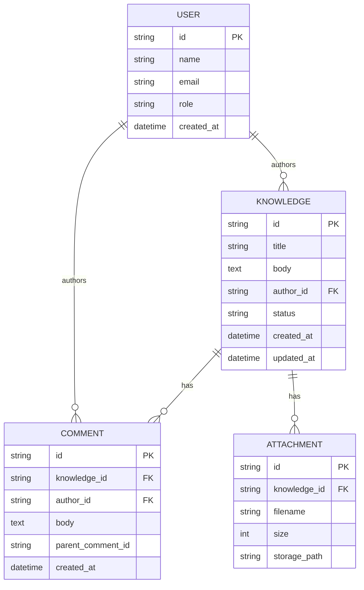

# AI活用ナレッジ共有サイト 要件定義書

## 1. ドキュメント情報
- **ドキュメント名**：AI活用ナレッジ共有サイト 要件定義書
- **バージョン**：1.0
- **作成日／更新日**：2025-11-19
- **作成者**：ニシザワ
- **承認者**：ニシザワ

## 2. 背景と目的
- **背景（現状／課題）**：
  - 社内でのAI活用に関する情報が散在し、必要情報を迅速に取得できない。
  - AI活用事例の共有とナレッジ蓄積が不十分である。
  - 投稿／編集が煩雑で、社員が積極的に情報共有しにくい。
  - 検索機能やセキュリティ管理が不十分で機密情報漏洩のリスクがある。
- **目的（プロジェクトで達成すること／成功指標）**：
  - 社内向けAI活用ナレッジ共有サイトを構築し、ナレッジ共有を促進する。
  - 成功指標（例）：
    - 月間アクティブユーザー >= 300（初期）、最終目標 600
    - 検索から目的の記事到達までの平均時間を 3分未満に短縮
    - ページロード P95 <= 3秒
    - システム稼働率 SLA 99.9%

## 3. スコープ
- **含む項目（機能／画面／データ）**：
  - 投稿・編集（テキスト、画像、リンク、ファイル添付）
  - タグ・カテゴリー管理、検索（キーワード・タグ）
  - コメント・返信、いいね（評価）
  - 投稿の編集履歴、管理者承認ワークフロー
  - ユーザー認証（メール承認 + 社内ドメインチェック）、アカウント作成、パスワードリセット
  - AI支援（要約、キーワード抽出、推薦）
  - ログ収集、監査ログ、バックアップ
- **除外項目（明確に）**：
  - 管理者向け高度ダッシュボード（将来的検討）
  - モバイル最適化（初期はデスクトップ優先）
  - 多言語対応（将来的検討）
  - 本番AWSへのデプロイ（設計は考慮するが本番リリースは対象外）

## 4. ステークホルダー
- **利用者（ペルソナ）**：
  - ペルソナA（業務担当者）：事例を検索・閲覧し、短時間で実務に適用したい。
  - ペルソナB（知識提供者）：事例を投稿・編集し、フィードバックを受け取りたい。
  - ペルソナC（管理者）：投稿承認・アクセス制御を行いたい。
- **関係者**：開発、運用、セキュリティ／法務、ビジネスオーナー
- **役割と責任（承認フロー）**：
  - 要件承認：ビジネスオーナー → 開発・運用レビュー → 承認（現状：ニシザワ）
  - 投稿承認：管理者が承認/却下を実施
  - 権限管理：管理者がユーザー権限を設定

## 5. 用語定義
- **ナレッジ**：投稿されたAI活用事例、ノウハウ等のコンテンツ単位
- **投稿者**：ナレッジを作成／編集する登録ユーザー
- **管理者**：投稿承認やユーザー権限管理を行うユーザー
- **タグ**：ナレッジを分類するキーワード
- **編集履歴**：投稿の差分、編集者、日時を保持する記録

## 6. 主要機能（機能要件）
- 機能ID：F-01
  - 機能名：投稿作成・編集
  - 概要：登録済みユーザーがナレッジを投稿・編集。テキスト、画像、リンク、ファイル添付対応。
  - ユーザーストーリー：投稿者が記事を投稿して社内で共有するため。
  - 受入基準：テキスト・画像・ファイル（最大50MB）を投稿・保存、タグ付け、編集履歴保存。
  - 優先度：MUST

- 機能ID：F-02
  - 機能名：検索（キーワード・タグ）
  - 概要：タイトル、本文、タグ、投稿者名で検索。
  - 受入基準：キーワード検索が上位50件を高速に返すこと（目標1秒）、タグフィルタ、スニペット表示。
  - 優先度：MUST

- 機能ID：F-03
  - 機能名：いいね（評価）
  - 優先度：SHOULD

- 機能ID：F-04
  - 機能名：コメント・返信
  - 優先度：MUST

- 機能ID：F-05
  - 機能名：編集履歴と差分表示
  - 優先度：SHOULD

- 機能ID：F-06
  - 機能名：承認ワークフロー（管理者承認）
  - 優先度：MUST

- 機能ID：F-07
  - 機能名：ユーザー認証・アカウント管理
  - 概要：メール承認 + 社内ドメインチェック、パスワードリセット。
  - 受入基準：社内ドメインメールのみ登録許可、パスワードはハッシュ化保存、管理者による権限変更。
  - 優先度：MUST

- 機能ID：F-08
  - 機能名：AI支援（要約・キーワード・推薦）
  - 優先度：SHOULD
  - 備考：外部クラウドAPI利用（許可済み）、ハルシネーション対策として根拠表示とフィードバック機能を実装。

## 7. 非機能要件
- **パフォーマンス**：ページ初期表示 P95 <= 3秒、検索応答 P95 <= 1秒（目標）
- **可用性**：SLA 99.9%（目標）
- **スケーラビリティ**：水平スケール可能な設計
- **セキュリティ**：TLS必須、パスワードはbcrypt等でハッシュ化、XSS/CSRF対策、社内ドメイン制限
- **プライバシー**：個人情報最小収集、ナレッジは永久保存、ログは30日保持
- **運用**：ログ保管期間 30日、DBは日次スナップショット、週次フルバックアップ
- **アクセシビリティ**：WCAG AA レベルを目標

## 8. データ要件
- **主なデータエンティティ**：User, Knowledge, Comment, Attachment, History, AuditLog
- **重要カラム（例）**：
  - `User.email`：string（必須、ユニーク、社内ドメイン）
  - `Knowledge.body`：text（必須）
  - `Attachment.size`：int（必須、上限）
- **保持ポリシー**：ナレッジ永久、ログ 30日、未承認下書きは180日でクリーンアップ検討
- **外部連携**：CSVインポート/エクスポート、外部AI API連携

## 9. UI／UX要件
- **画面一覧**：ダッシュボード、投稿一覧、ナレッジ詳細、投稿作成/編集、ユーザープロファイル、管理者画面
- **主要画面の要件**：ナレッジ詳細に本文、タグ、添付、いいね、コメント、編集履歴、AI要約を表示
- **ワイヤーフレーム必須要素**：グローバルナビ（検索バー、投稿ボタン、ユーザーアイコン）、検索結果スニペット、タグクラウド
- **アクセシビリティ**：WCAG AA 準拠

## 10. API要件
- **主なエンドポイント（概略）**：
  - `POST /api/auth/register`（メール承認 + ドメインチェック）
  - `POST /api/auth/login`（JWT発行）
  - `POST /api/knowledge`（作成）
  - `GET /api/knowledge`（検索）
  - `GET /api/knowledge/{id}`（詳細）
  - `PUT /api/knowledge/{id}`（編集）
  - `POST /api/knowledge/{id}/like`（いいね）
  - `POST /api/knowledge/{id}/comments`（コメント）
- **認可方式**：JWT ベース（初期）。将来的に SSO（SAML/LDAP）検討
- **レート制限**：設計段階で設定（例：ユーザー単位のRPM）

## 11. AI利用に関する要件
- **利用ケース**：要約、キーワード抽出、類似推薦
- **モデル要件**：外部クラウドAPI利用（許可済み）、要約レイテンシ目標 <= 1.5秒
- **学習データと著作権**：外部著作物は原則学習に使用しない方針
- **誤出力対策**：AI出力は明示ラベルを付与し、抜粋などの根拠を表示。フィードバック機能を設置

## 12. 受入基準とテスト
- **受入基準**：MUST機能はUATで合格。投稿→承認→公開の一連フローが正常動作
- **テスト項目**：単体・結合・E2E・性能・セキュリティテスト
- **テストデータ**：代表的投稿（長文、添付あり/なし）を用意

## 13. 移行・リリース計画
- **データ移行**：CSVでのインポートを想定。移行前バックアップと整合性チェック実施
- **リリース方式**：疑似プロジェクトでは簡易リリース。実運用時はブルー/グリーン等を推奨
- **ロールバック条件**：認証停止・DB破損等の重大障害時にスナップショットへロールバック

## 14. 運用・監視・保守
- **監視項目**：応答時間（P95）、エラー率、ディスク使用率、DB接続数、AI APIレイテンシ
- **アラート閾値**：応答時間 P95 > 5秒（警告）、>10秒（重大）／エラー率 >1%（警告）
- **バックアップ**：DB日次スナップショット、週次フルバックアップ

## 15. リスクと対策
- 外部AI API停止：冗長API、フォールバック表示を用意
- 個人情報漏えい：最小収集、暗号化、アクセス制御、監査ログ
- 検索性能劣化：全文検索エンジンとインデックス戦略を採用
- AI誤出力：根拠表示とユーザーフィードバック回収

## 16. スケジュールとマイルストーン（概算）
- 要件定義：2025-11-19 〜 2025-12-02
- 基本設計：2025-12-03 〜 2025-12-23
- 実装：2026-01-06 〜 2026-02-28
- テスト：2026-03-02 〜 2026-03-22
- リリース（検証環境→最終レビュー）：2026-03-23 〜 2026-03-29

## 17. 成果物と承認
- **提出物**：要件定義書（本書）、API仕様書、ワイヤーフレーム、テスト計画・報告書
- **承認プロセス**：レビュー後、ビジネスオーナー（ニシザワ）承認で次フェーズへ移行

## 18. 変更管理
- **提出方法**：チケット（JIRA等）で変更要求を提出
- **承認フロー**：開発／運用／ビジネスオーナーで影響評価後承認
- **バージョン管理**：`v{major}.{minor}` と変更履歴を保持

## 19. 参考資料・添付
- `docs/00_personal/nakamura/03_顧客要求事項.md`
- `docs/02_design/architecture.md`

---

## 図（Mermaid）

### システム概観
```mermaid
flowchart LR
  A[ユーザー（ブラウザ）] -->|HTTPS| B[Webアプリ (Frontend)]
  B -->|API| C[APIサーバ (Backend)]
  C --> D[(RDBMS)]
  C --> E[(全文検索エンジン)]
  C --> F[外部AI API]
  C --> G[メールサービス (承認メール送信)]
  C --> H[オブジェクトストレージ]
  subgraph セキュリティ
    I[TLS] 
  end
  A --- I
```

### データモデル（ER: 主要エンティティ）


---

### 追加確認事項（現時点での答えを反映済み）
- 認証：メール承認 + 社内ドメインチェック（本実装で採用）
- データ保持：ログ 30日、ナレッジ 永久
- アクセシビリティ：WCAG AA
- AI利用：外部クラウドAPI利用で問題なし

---

作成者・承認者（仮）：ニシザワ
# AI活用ナレッジ共有サイト 要件定義書

## 1. ドキュメント情報
- **ドキュメント名**：AI活用ナレッジ共有サイト 要件定義書
- **バージョン**：1.0
- **作成日／更新日**：2025-11-19
- **作成者**：ニシザワ
- **承認者**：ニシザワ

## 2. 背景と目的
- **背景（現状／課題）**：
  - 社内でのAI活用に関する情報が散在し、必要情報を迅速に取得できない。
  - AI活用事例の共有とナレッジ蓄積が不十分である。
  - 投稿／編集が煩雑で、社員が積極的に情報共有しにくい。
  - 検索機能やセキュリティ管理が不十分で機密情報漏洩のリスクがある。
- **目的（プロジェクトで達成すること／成功指標）**：
  - 社内向けAI活用ナレッジ共有サイトを構築し、ナレッジ共有を促進する。
  - 成功指標（例）：
    - 月間アクティブユーザー >= 300（初期）、最終目標 600
    - 検索から目的の記事到達までの平均時間を 3分未満に短縮
    - ページロード P95 <= 3秒
    - システム稼働率 SLA 99.9%

## 3. スコープ
- **含む項目（機能／画面／データ）**：
  - 投稿・編集（テキスト、画像、リンク、ファイル添付）
  - タグ・カテゴリー管理、検索（キーワード・タグ）
  - コメント・返信、いいね（評価）
  - 投稿の編集履歴、管理者承認ワークフロー
  - ユーザー認証（メール承認 + 社内ドメインチェック）、アカウント作成、パスワードリセット
  - AI支援（要約、キーワード抽出、推薦）
  - ログ収集、監査ログ、バックアップ
- **除外項目（明確に）**：
  - 管理者向け高度ダッシュボード（将来的検討）
  - モバイル最適化（初期はデスクトップ優先）
  - 多言語対応（将来的検討）
  - 本番AWSへのデプロイ（設計は考慮するが本番リリースは対象外）

## 4. ステークホルダー
- **利用者（ペルソナ）**：
  - ペルソナA（業務担当者）：事例を検索・閲覧し、短時間で実務に適用したい。
  - ペルソナB（知識提供者）：事例を投稿・編集し、フィードバックを受け取りたい。
  - ペルソナC（管理者）：投稿承認・アクセス制御を行いたい。
- **関係者**：開発、運用、セキュリティ／法務、ビジネスオーナー
- **役割と責任（承認フロー）**：
  - 要件承認：ビジネスオーナー → 開発・運用レビュー → 承認（現状：ニシザワ）
  - 投稿承認：管理者が承認/却下を実施
  - 権限管理：管理者がユーザー権限を設定

## 5. 用語定義
- **ナレッジ**：投稿されたAI活用事例、ノウハウ等のコンテンツ単位
- **投稿者**：ナレッジを作成／編集する登録ユーザー
- **管理者**：投稿承認やユーザー権限管理を行うユーザー
- **タグ**：ナレッジを分類するキーワード
- **編集履歴**：投稿の差分、編集者、日時を保持する記録

## 6. 主要機能（機能要件）
- 機能ID：F-01
  - 機能名：投稿作成・編集
  - 概要：登録済みユーザーがナレッジを投稿・編集。テキスト、画像、リンク、ファイル添付対応。
  - ユーザーストーリー：投稿者が記事を投稿して社内で共有するため。
  - 受入基準：テキスト・画像・ファイル（最大50MB）を投稿・保存、タグ付け、編集履歴保存。
  - 優先度：MUST

- 機能ID：F-02
  - 機能名：検索（キーワード・タグ）
  - 概要：タイトル、本文、タグ、投稿者名で検索。
  - 受入基準：キーワード検索が上位50件を高速に返すこと（目標1秒）、タグフィルタ、スニペット表示。
  - 優先度：MUST

- 機能ID：F-03
  - 機能名：いいね（評価）
  - 優先度：SHOULD

- 機能ID：F-04
  - 機能名：コメント・返信
  - 優先度：MUST

- 機能ID：F-05
  - 機能名：編集履歴と差分表示
  - 優先度：SHOULD

- 機能ID：F-06
  - 機能名：承認ワークフロー（管理者承認）
  - 優先度：MUST

- 機能ID：F-07
  - 機能名：ユーザー認証・アカウント管理
  - 概要：メール承認 + 社内ドメインチェック、パスワードリセット。
  - 受入基準：社内ドメインメールのみ登録許可、パスワードはハッシュ化保存、管理者による権限変更。
  - 優先度：MUST

- 機能ID：F-08
  - 機能名：AI支援（要約・キーワード・推薦）
  - 優先度：SHOULD
  - 備考：外部クラウドAPI利用（許可済み）、ハルシネーション対策として根拠表示とフィードバック機能を実装。

## 7. 非機能要件
- **パフォーマンス**：ページ初期表示 P95 <= 3秒、検索応答 P95 <= 1秒（目標）
- **可用性**：SLA 99.9%（目標）
- **スケーラビリティ**：水平スケール可能な設計
- **セキュリティ**：TLS必須、パスワードはbcrypt等でハッシュ化、XSS/CSRF対策、社内ドメイン制限
- **プライバシー**：個人情報最小収集、ナレッジは永久保存、ログは30日保持
- **運用**：ログ保管期間 30日、DBは日次スナップショット、週次フルバックアップ
- **アクセシビリティ**：WCAG AA レベルを目標

## 8. データ要件
- **主なデータエンティティ**：User, Knowledge, Comment, Attachment, History, AuditLog
- **重要カラム（例）**：
  - `User.email`：string（必須、ユニーク、社内ドメイン）
  - `Knowledge.body`：text（必須）
  - `Attachment.size`：int（必須、上限）
- **保持ポリシー**：ナレッジ永久、ログ 30日、未承認下書きは180日でクリーンアップ検討
- **外部連携**：CSVインポート/エクスポート、外部AI API連携

## 9. UI／UX要件
- **画面一覧**：ダッシュボード、投稿一覧、ナレッジ詳細、投稿作成/編集、ユーザープロファイル、管理者画面
- **主要画面の要件**：ナレッジ詳細に本文、タグ、添付、いいね、コメント、編集履歴、AI要約を表示
- **ワイヤーフレーム必須要素**：グローバルナビ（検索バー、投稿ボタン、ユーザーアイコン）、検索結果スニペット、タグクラウド
- **アクセシビリティ**：WCAG AA 準拠

## 10. API要件
- **主なエンドポイント（概略）**：
  - `POST /api/auth/register`（メール承認 + ドメインチェック）
  - `POST /api/auth/login`（JWT発行）
  - `POST /api/knowledge`（作成）
  - `GET /api/knowledge`（検索）
  - `GET /api/knowledge/{id}`（詳細）
  - `PUT /api/knowledge/{id}`（編集）
  - `POST /api/knowledge/{id}/like`（いいね）
  - `POST /api/knowledge/{id}/comments`（コメント）
- **認可方式**：JWT ベース（初期）。将来的に SSO（SAML/LDAP）検討
- **レート制限**：設計段階で設定（例：ユーザー単位のRPM）

## 11. AI利用に関する要件
- **利用ケース**：要約、キーワード抽出、類似推薦
- **モデル要件**：外部クラウドAPI利用（許可済み）、要約レイテンシ目標 <= 1.5秒
- **学習データと著作権**：外部著作物は原則学習に使用しない方針
- **誤出力対策**：AI出力は明示ラベルを付与し、抜粋などの根拠を表示。フィードバック機能を設置

## 12. 受入基準とテスト
- **受入基準**：MUST機能はUATで合格。投稿→承認→公開の一連フローが正常動作
- **テスト項目**：単体・結合・E2E・性能・セキュリティテスト
- **テストデータ**：代表的投稿（長文、添付あり/なし）を用意

## 13. 移行・リリース計画
- **データ移行**：CSVでのインポートを想定。移行前バックアップと整合性チェック実施
- **リリース方式**：疑似プロジェクトでは簡易リリース。実運用時はブルー/グリーン等を推奨
- **ロールバック条件**：認証停止・DB破損等の重大障害時にスナップショットへロールバック

## 14. 運用・監視・保守
- **監視項目**：応答時間（P95）、エラー率、ディスク使用率、DB接続数、AI APIレイテンシ
- **アラート閾値**：応答時間 P95 > 5秒（警告）、>10秒（重大）／エラー率 >1%（警告）
- **バックアップ**：DB日次スナップショット、週次フルバックアップ

## 15. リスクと対策
- 外部AI API停止：冗長API、フォールバック表示を用意
- 個人情報漏えい：最小収集、暗号化、アクセス制御、監査ログ
- 検索性能劣化：全文検索エンジンとインデックス戦略を採用
- AI誤出力：根拠表示とユーザーフィードバック回収

## 16. スケジュールとマイルストーン（概算）
- 要件定義：2025-11-19 〜 2025-12-02
- 基本設計：2025-12-03 〜 2025-12-23
- 実装：2026-01-06 〜 2026-02-28
- テスト：2026-03-02 〜 2026-03-22
- リリース（検証環境→最終レビュー）：2026-03-23 〜 2026-03-29

## 17. 成果物と承認
- **提出物**：要件定義書（本書）、API仕様書、ワイヤーフレーム、テスト計画・報告書
- **承認プロセス**：レビュー後、ビジネスオーナー（ニシザワ）承認で次フェーズへ移行

## 18. 変更管理
- **提出方法**：チケット（JIRA等）で変更要求を提出
- **承認フロー**：開発／運用／ビジネスオーナーで影響評価後承認
- **バージョン管理**：`v{major}.{minor}` と変更履歴を保持

## 19. 参考資料・添付
- `/d/AI駆動開発デモ/proj-1sys-ax-2025/docs/00_personal/nakamura/03_顧客要求事項.md`
- `/d/AI駆動開発デモ/proj-1sys-ax-2025/docs/02_design/architecture.md`

---

## 図（Mermaid）

### システム概観
```mermaid
flowchart LR
  A[ユーザー（ブラウザ）] -->|HTTPS| B[Webアプリ (Frontend)]
  B -->|API| C[APIサーバ (Backend)]
  C --> D[(RDBMS)]
  C --> E[(全文検索エンジン)]
  C --> F[外部AI API]
  C --> G[メールサービス (承認メール送信)]
  C --> H[オブジェクトストレージ]
  subgraph セキュリティ
    I[TLS] 
  end
  A --- I
```

### データモデル（ER: 主要エンティティ）


---

### 追加確認事項（現時点での答えを反映済み）
- 認証：メール承認 + 社内ドメインチェック（本実装で採用）
- データ保持：ログ 30日、ナレッジ 永久
- アクセシビリティ：WCAG AA
- AI利用：外部クラウドAPI利用で問題なし

---

作成者・承認者（仮）：ニシザワ
