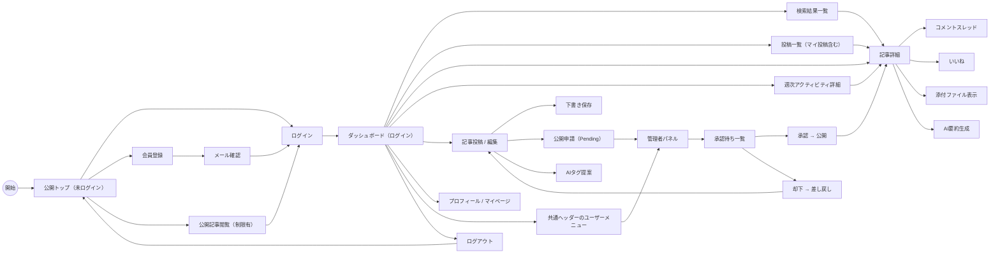

# 基本設計 — 画面遷移図

## 1. 概要
本ドキュメントは「AI活用ナレッジ共有サイト」Ver1.0（MVP）に必要な画面と遷移を定義する。認証、投稿・承認ワークフロー、検索、コメント・いいね等の主要フローを対象とする。

## 2. 画面遷移図（Mermaid）

```mermaid
flowchart LR
  %% スタート
  START((開始)) --> PublicHome["公開トップ（未ログイン）"]
  PublicHome --> Login["ログイン"]
  PublicHome --> Register["会員登録"]
  Register --> EmailVerify["メール確認"]
  EmailVerify --> Login["ログイン"]

  %% 認証後メイン
  Login["ログイン"] --> Dashboard["ダッシュボード（ログイン）"]
  Dashboard["ダッシュボード（ログイン）"] --> Search["検索結果一覧"]
  Dashboard["ダッシュボード（ログイン）"] --> PostList["投稿一覧（マイ投稿含む）"]
  Dashboard["ダッシュボード（ログイン）"] --> ArticleDetail["記事詳細"]
  Dashboard["ダッシュボード（ログイン）"] --> ActivityDetail["週次アクティビティ詳細"]
  Dashboard["ダッシュボード（ログイン）"] --> PostEditor["記事投稿 / 編集"]
  Dashboard["ダッシュボード（ログイン）"] --> Profile["プロフィール / マイページ"]
  Dashboard["ダッシュボード（ログイン）"] --> UserMenu["共通ヘッダーのユーザーメニュー"]
  UserMenu["共通ヘッダーのユーザーメニュー"] --> AdminPanel["管理者パネル"]

  %% 投稿フロー
  PostEditor["記事投稿 / 編集"] --> DraftSaved["下書き保存"]
  PostEditor["記事投稿 / 編集"] --> SubmitPending["公開申請（Pending）"]
  SubmitPending["公開申請（Pending）"] --> AdminPanel["管理者パネル"]

  %% 記事詳細機能
  ArticleDetail["記事詳細"] --> CommentThread["コメントスレッド"]
  ArticleDetail["記事詳細"] --> LikeAction["いいね"]
  ArticleDetail["記事詳細"] --> Attachments["添付ファイル表示"]
  ArticleDetail["記事詳細"] --> AI_Summary["AI要約生成"]
  PostEditor["記事投稿 / 編集"] --> AI_Suggest["AIタグ提案"]

  %% 管理者ワークフロー
  AdminPanel["管理者パネル"] --> ReviewQueue["承認待ち一覧"]
  ReviewQueue["承認待ち一覧"] --> Approve["承認 → 公開"]
  ReviewQueue["承認待ち一覧"] --> Reject["却下 → 差し戻し"]
  Approve["承認 → 公開"] --> ArticleDetail["記事詳細"]
  Reject["却下 → 差し戻し"] --> PostEditor["記事投稿 / 編集"]

  %% 検索遷移
  Search["検索結果一覧"] --> ArticleDetail["記事詳細"]
  PostList["投稿一覧（マイ投稿含む）"] --> ArticleDetail["記事詳細"]
  ActivityDetail["週次アクティビティ詳細"] --> ArticleDetail["記事詳細"]

  %% ログアウト
  Dashboard["ダッシュボード（ログイン）"] --> Logout["ログアウト"] --> PublicHome["公開トップ（未ログイン）"]

  %% 未ログインからの閲覧制御
  PublicHome["公開トップ（未ログイン）"] --> PublicArticle["公開記事閲覧（制限有）"]
  PublicArticle["公開記事閲覧（制限有）"] --> Login["ログイン"]
```

## 3. 画面一覧と説明
| 画面ID | 画面名 | 説明 |
| :--- | :--- | :--- |
| SCR-01 | ログイン画面 | 社内ドメイン（@ginga.info）でのログイン。パスワード忘れ／SSO連携候補。 |
| SCR-02 | 会員登録 | メール受信→確認リンクで有効化（Double Opt-in）。ドメインチェックあり。 |
| SCR-03 | ダッシュボード | ログイン後のメイン画面。ダッシュボードは以下を表示する: 新着（デフォルト3件）、おすすめ（1件）。画面上部にクイック操作領域（「新着」「おすすめ」）を配置。新規投稿は左ナビの「＋ 新規投稿」ボタンから実行する。右側ウィジェットは承認待ち件数や週次アクティビティ等の管理情報を表示。管理者向けの操作や承認一覧は `共通ヘッダーのユーザーメニュー` にある「管理者パネル」ボタンで遷移する（RBACで表示制御）。

  - 週次アクティビティのクリック挙動:
    - 動作: 週次アクティビティをクリックすると詳細画面へ遷移（例: `/dashboard/activity?range=week`）。
    - API: ページロード時に `GET /api/v1/dashboard/activity?range=week` を呼び出し、概要および日別内訳を取得する。
    - 権限: 管理者向けは RBAC により表示／アクセス制御する。

| SCR-04 | 検索結果一覧 | タイトル/本文/タグ/投稿者で検索。フィルタ・ソートを提供。 |
| SCR-05 | 投稿一覧（マイ投稿） | 自分の投稿一覧／ステータス表示（Draft/Pending/Published/Declined）。 |
| SCR-06 | 記事詳細画面 | Markdownレンダリング、添付、いいね、コメント、編集履歴リンク、AI要約表示。 |
| SCR-07 | 記事投稿・編集画面 | Markdownエディタ、画像/添付アップロード、タグ選択、公開ステータス指定、AIタグ提案。 |
| SCR-08 | コメントスレッド | スレッド形式のコメント／返信機能。モデレーション（通報）ボタン。 |
| SCR-09 | プロフィール / マイページ | ユーザー情報、作成記事一覧、編集履歴へのアクセス。 |
| SCR-10 | 管理者パネル | 投稿承認/却下、ユーザー権限管理、不適切投稿対応、監査ログ参照。 |
| SCR-11 | 承認待ち一覧（Review） | 管理者向け：Pending投稿の確認・承認・却下操作。 |
| SCR-12 | 公開トップ（未ログイン） | 未ログイン時の公開可能記事一覧（閲覧制限はポリシー次第）。 |

## 4. アーキテクチャ（画面側の方針）
- フロントエンド: Next.js (React, TypeScript) を採用。
  - ページルーティングは Next.js（サーバーサイドレンダリング/静的生成を用途で使い分け）。
  - UI コンポーネント: 再利用可能なコンポーネント群（Design System）を用意。
  - クライアント側状態管理: React Context / SWR または React Query を利用。
  - 認証: API は JWT（Bearer）を利用。アクセストークンはメモリ/短寿命、リフレッシュは httpOnly cookie で保持して更新。
  - API 通信: /api/v1 エンドポイントへ fetch/axios。エラー共通処理とリトライ/スロットリング対応を実装。
- アクセシビリティとパフォーマンス: Lighthouse を基準に最適化（画像最適化、遅延ロード、コード分割）。

## 5. 備考
- 承認ワークフローは必須（Pending → 管理者承認で Published）。  
- 初期はDBベースの検索、将来的に全文検索エンジン導入を想定。  
- アクセス制御はRBACで実装し、管理者向け操作は AdminPanel に集約する。

## 6. 変更履歴
- 0.1 初版 — 2025-12-15
- 0.2 軽微修正（文言・図の整理） — 2026-01-05
- 0.3 ダッシュボード関連の仕様修正 — 2026-02-14
  - 管理者パネルへの遷移を「共通ヘッダーのユーザーメニュー」経由に変更
  - `最近のアクティビティ` ウィジェットは未実装扱いに変更
  - ダッシュボードに表示する項目を明確化: 新着（デフォルト3件）、おすすめ（1件）
  - クイック操作の遷移を定義（新着→記事一覧(per_page=10)、おすすめ→推薦一覧(per_page=5)）
