# 基本設計 — 画面遷移図

## 1. 概要
本ドキュメントは「AI活用ナレッジ共有サイト」Ver1.0（MVP）に必要な画面と遷移を定義する。認証、投稿・承認ワークフロー、検索、コメント・いいね等の主要フローを対象とする。

## 2. 画面遷移図（Mermaid）

```mermaid
flowchart LR
  %% スタート
  START((開始)) --> PublicHome["公開トップ（未ログイン）"]
  PublicHome --> Login["ログイン"]
  PublicHome --> Register["会員登録"]
  Register --> EmailVerify["メール確認"]
  EmailVerify --> Login["ログイン"]

  %% 認証後メイン
  Login["ログイン"] --> Dashboard["ダッシュボード（ログイン）"]
  Dashboard["ダッシュボード（ログイン）"] --> Search["検索結果一覧"]
  Dashboard["ダッシュボード（ログイン）"] --> PostList["投稿一覧（マイ投稿含む）"]
  Dashboard["ダッシュボード（ログイン）"] --> ArticleDetail["記事詳細"]
  Dashboard["ダッシュボード（ログイン）"] --> PostEditor["記事投稿 / 編集"]
  Dashboard["ダッシュボード（ログイン）"] --> Profile["プロフィール / マイページ"]
  Dashboard["ダッシュボード（ログイン）"] --> AdminPanel["管理者パネル"]

  %% 投稿フロー
  PostEditor["記事投稿 / 編集"] --> DraftSaved["下書き保存"]
  PostEditor["記事投稿 / 編集"] --> SubmitPending["公開申請（Pending）"]
  SubmitPending["公開申請（Pending）"] --> AdminPanel["管理者パネル"]

  %% 記事詳細機能
  ArticleDetail["記事詳細"] --> CommentThread["コメントスレッド"]
  ArticleDetail["記事詳細"] --> LikeAction["いいね"]
  ArticleDetail["記事詳細"] --> Attachments["添付ファイル表示"]
  ArticleDetail["記事詳細"] --> AI_Summary["AI要約生成"]
  PostEditor["記事投稿 / 編集"] --> AI_Suggest["AIタグ提案"]

  %% 管理者ワークフロー
  AdminPanel["管理者パネル"] --> ReviewQueue["承認待ち一覧"]
  ReviewQueue["承認待ち一覧"] --> Approve["承認 → 公開"]
  ReviewQueue["承認待ち一覧"] --> Reject["却下 → 差し戻し"]
  Approve["承認 → 公開"] --> ArticleDetail["記事詳細"]
  Reject["却下 → 差し戻し"] --> PostEditor["記事投稿 / 編集"]

  %% 検索遷移
  Search["検索結果一覧"] --> ArticleDetail["記事詳細"]
  PostList["投稿一覧（マイ投稿含む）"] --> ArticleDetail["記事詳細"]

  %% ログアウト
  Dashboard["ダッシュボード（ログイン）"] --> Logout["ログアウト"] --> PublicHome["公開トップ（未ログイン）"]

  %% 未ログインからの閲覧制御
  PublicHome["公開トップ（未ログイン）"] --> PublicArticle["公開記事閲覧（制限有）"]
  PublicArticle["公開記事閲覧（制限有）"] --> Login["ログイン"]
```

## 3. 画面一覧と説明
| 画面ID | 画面名 | 説明 |
| :--- | :--- | :--- |
| SCR-01 | ログイン画面 | 社内ドメイン（@ginga.info）でのログイン。パスワード忘れ／SSO連携候補。 |
| SCR-02 | 会員登録 | メール受信→確認リンクで有効化（Double Opt-in）。ドメインチェックあり。 |
| SCR-03 | ダッシュボード | ログイン後のメイン画面。新着・おすすめ・クイック検索を表示。 |
| SCR-04 | 検索結果一覧 | タイトル/本文/タグ/投稿者で検索。フィルタ・ソートを提供。 |
| SCR-05 | 投稿一覧（マイ投稿） | 自分の投稿一覧／ステータス表示（Draft/Pending/Published/Declined）。 |
| SCR-06 | 記事詳細画面 | Markdownレンダリング、添付、いいね、コメント、編集履歴リンク、AI要約表示。 |
| SCR-07 | 記事投稿・編集画面 | Markdownエディタ、画像/添付アップロード、タグ選択、公開ステータス指定、AIタグ提案。 |
| SCR-08 | コメントスレッド | スレッド形式のコメント／返信機能。モデレーション（通報）ボタン。 |
| SCR-09 | プロフィール / マイページ | ユーザー情報、作成記事一覧、編集履歴へのアクセス。 |
| SCR-10 | 管理者パネル | 投稿承認/却下、ユーザー権限管理、不適切投稿対応、監査ログ参照。 |
| SCR-11 | 承認待ち一覧（Review） | 管理者向け：Pending投稿の確認・承認・却下操作。 |
| SCR-12 | 公開トップ（未ログイン） | 未ログイン時の公開可能記事一覧（閲覧制限はポリシー次第）。 |

## 4. 備考
- 承認ワークフローは必須（Pending → 管理者承認で Published）。  
- 初期はDBベースの検索、将来的に全文検索エンジン導入を想定。  
- アクセス制御はRBACで実装し、管理者向け操作は AdminPanel に集約する。
