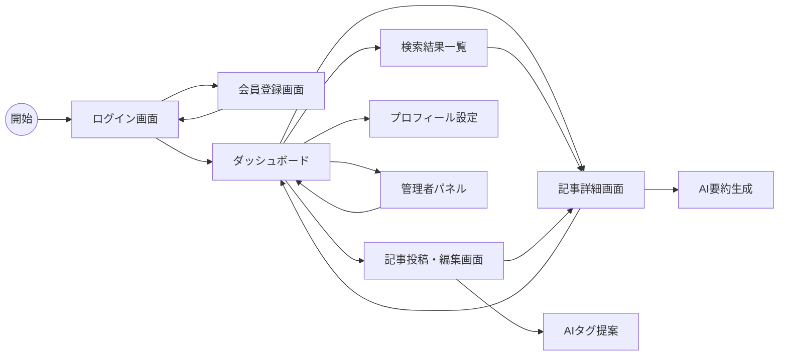

# 画面遷移図

## 1. 概要
本ドキュメントは「AI活用ナレッジ共有サイト」の画面遷移を定義する。

## 2. 画面遷移図（Mermaid）

## 3. 画面一覧と説明
| 画面ID | 画面名 | 説明 |
| :--- | :--- | :--- |
| SCR-01 | ログイン画面 | ユーザー認証を行う。 |
| SCR-02 | ダッシュボード | 新着記事やおすすめ記事を表示する。 |
| SCR-03 | 記事詳細画面 | 記事// filepath: docs/design/screen_transition.md