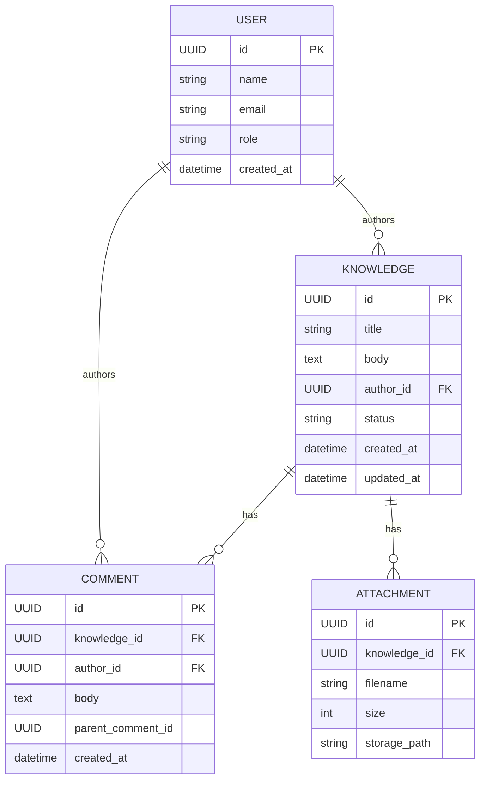

# 統合要件定義書

**バージョン**: 1.0
**作成日**: 2025-12-06

## 1. はじめに
### 1.1 ドキュメントの目的
本書は、社内向け「AI活用ナレッジ共有サイト」構築プロジェクトにおける統合要件定義書である。
本プロジェクトの目的、範囲、機能要件、非機能要件、および運用方針を明確化し、設計・開発フェーズへのインプットとすることを目的とする。

### 1.2 背景と課題
現在、社内でのAI活用に関するノウハウや事例が個人のローカル環境や散在したチャットツールに留まっており、全社的なナレッジとして蓄積・活用されていない。これにより、類似の検証作業の重複や、有用な知見の埋没が発生している。

### 1.3 プロジェクトの目的
社内ナレッジ共有プラットフォームを構築し、以下の実現を目指す。
1. AI活用事例の集約と検索性の向上
2. 社員間のナレッジ共有文化の醸成
3. 業務効率化と品質向上

### 1.4 成功指標 (KPI)
- **DAU (Daily Active Users)**: リリース直後 50〜100名、長期的には600名（全社員）の利用を目指す。
- **検索到達時間**: 目的の記事に到達するまでの平均時間を3分未満とする。
- **システム稼働率**: SLA 99.9% を目標とする。
- **ページロード時間**: P95 で 3秒以内。

## 2. スコープ (範囲)
### 2.1 対象範囲 (In-Scope)
- **ユーザー機能**: アカウント登録・認証、記事の投稿・編集・閲覧、検索、コメント・いいね。
- **管理者機能**: 投稿の承認・却下、ユーザー権限管理、不適切コンテンツの管理。
- **システム基盤**: ログ収集、データバックアップ、セキュリティ対策。

### 2.2 対象外範囲 (Out-of-Scope)
- モバイルネイティブアプリの開発（レスポンシブWebデザインで対応）。
- 高度な分析ダッシュボード（Ver2以降で検討）。
- 多言語対応。
- 外部ユーザーへの公開機能。

### 2.3 開発環境
- Dockerを用いて開発環境を統一する。

## 3. ステークホルダー
| ロール | ペルソナ・役割 |
| :--- | :--- |
| **利用者 (業務担当者)** | AI活用事例を検索し、自身の業務に適用したい社員。情報の探しやすさを重視。 |
| **利用者 (知識提供者)** | 自身の知見を投稿し、フィードバックを得たい社員。投稿のしやすさを重視。 |
| **管理者** | 投稿内容の品質担保（承認）、セキュリティ管理、ユーザー管理を行う担当者。 |
| **ビジネスオーナー** | プロジェクトの予算・方針決定、最終リリースの承認を行う。 |

## 4. 機能要件
### 4.1 認証・ユーザー管理 (F-01)
- **社内ドメイン制限**: 新規登録は `@ginga.info` ドメインのメールアドレスのみ許可する。
- **メール確認**: 登録時に確認メールを送信し、リンク踏破によりアカウントを有効化する（Double Opt-in）。
- **パスワード管理**: パスワードは `bcrypt` (work factor >= 12) を用いてハッシュ化保存する。
- **権限管理**: ユーザーロール（Admin, User等）によるアクセス制御（RBAC）を実装する。

### 4.2 投稿・編集 (F-02)
- **記事作成**: Markdown記法をサポートしたエディタを提供する。
- **メディア対応**:
  - 画像アップロード（最大 10MB/ファイル）。
  - 添付ファイル（最大 50MB/ファイル）。
- **ステータス管理**: `下書き (Draft)`、`承認待ち (Pending)`、`公開 (Published)`、`却下 (Declined)`、`削除 (Deleted/Archived)` の状態を持つ。
- **編集履歴**: 投稿の変更履歴を保持し、過去バージョンを参照可能にする。
- **削除機能**: 投稿者本人および管理者は、投稿を論理削除状態にできる。

### 4.3 検索・閲覧 (F-03)
- **検索機能**: タイトル、本文、タグ、投稿者名を対象としたキーワード検索を提供する。
- **フィルタ**: タグ、投稿者、日付による絞り込み機能。
- **ソート**: 新着順、人気順（いいね数等）での並び替え。
- **実装方針**: 初期リリース(MVP)ではRDBMSの機能を用いた検索とし、将来的にElasticsearch等の全文検索エンジン導入を検討する。

### 4.4 承認ワークフロー (F-04)
- **承認プロセス**: ユーザーが投稿を「公開申請」するとステータスが `Pending` となり、管理者に通知される。
- **管理者操作**: 管理者は内容を確認し、「承認（公開）」または「却下（差し戻し）」を行う。
- **監査**: 承認・却下の操作は履歴として記録する。

### 4.5 インタラクション (F-05)
- **いいね**: 記事に対して「いいね」評価を行える（1ユーザーにつき1回/記事）。
- **コメント**: 記事に対してコメントを投稿できる。スレッド形式（返信）をサポートする。

## 5. 非機能要件
### 5.1 セキュリティ
- **通信暗号化**: 全ての通信を TLS 1.2 以上（推奨 TLS 1.3）で暗号化する。
- **脆弱性対策**: OWASP Top 10 に準拠し、XSS, CSRF, SQLインジェクション等の対策を実装する。
- **監査ログ**: ログイン、権限変更、承認操作などの重要イベントをログとして記録・保存する。

### 5.2 パフォーマンス
- **レスポンス目標**: ページロード時間 P95 <= 3秒。検索応答 P95 <= 1.5秒（目標）。
- **同時接続数**: ピーク時 100 セッションの同時アクセスに耐えうること。

### 5.3 可用性・運用
- **バックアップ**: データベースの日次スナップショットを取得し、最低30日間保持する。
- **ログ保持**: アプリケーションログおよび監査ログは最低30日間保持する（将来的に365日へ拡張）。
- **開発環境**: Docker / Docker Compose を用いて開発環境を統一し、環境差異によるトラブルを防止する。

## 6. データ要件
### 6.1 主要エンティティ
- **User**: ユーザーID(UUID), name, メールアドレス, パスワードハッシュ, ロール, 作成日時, 更新日時
- **Knowledge (Post)**: 記事ID(UUID), タイトル, 本文, 著者ID, ステータス, タグ, 作成日時, 更新日時
- **Comment**: コメントID, 記事ID, 著者ID, 本文, 親コメントID
- **Attachment**: ファイルID, 記事ID, ファイル名, 保存パス, サイズ
- **AuditLog**: ログID, 操作者ID, 操作内容, 対象ID, 日時

### 6.2 データ保持ポリシー
- **ナレッジデータ**: サービス継続中は永久保存。
- **未承認下書き**: 長期間（例: 180日）更新がない場合はクリーンアップを検討。

## 7. アーキテクチャ・システム構成
### 7.1 技術スタック (想定)
- **Frontend**: React + TypeScript
- **Backend**: Node.js (Express or NestJS) + TypeScript
- **Database**: RDBMS (PostgreSQL 推奨)
- **Storage**: オブジェクトストレージ (S3互換)

### 7.2 システム概観図
```mermaid
flowchart LR
  A[ユーザー（ブラウザ）] -->|HTTPS| B[Webアプリ (Frontend)]
  B -->|API (JWT)| C[APIサーバ (Backend)]
  C --> D[(RDBMS: Postgres)]
  C --> E[(全文検索: Elasticsearch) - optional]
  C --> F[オブジェクトストレージ (S3)]
  C --> G[メールサービス (SMTP/社内API)]
  subgraph セキュリティ
    I[TLS]
  end
  A --- I
```

### 7.3 データモデル (ER図)


### 7.4 データフロー図
`proj-1sys-ax-2025/docs/00_personal/nagumo/data_flow.svg` を参照。

## 8. API要件
- **設計原則**: RESTful APIを採用し、`/api/v1/` のようにバージョニングを行う。
- **認証方式**: JWT (JSON Web Token) を使用したステートレス認証。
- **主要エンドポイント例**:
  - `POST /api/auth/register`（メール承認 + ドメインチェック）
  - `POST /api/auth/login`（JWT発行）
  - `POST /api/knowledge`（作成）
  - `GET /api/knowledge`（検索）
  - `GET /api/knowledge/{id}`（詳細）
  - `PUT /api/knowledge/{id}`（編集）
  - `POST /api/knowledge/{id}/like`（いいね）
  - `POST /api/knowledge/{id}/comments`（コメント）

## 9. UI/UX要件・画面仕様
### 9.1 画面仕様（概略）
- **画面一覧**:
  - ホーム（投稿一覧）
  - 投稿詳細
  - 投稿作成
  - 投稿編集
  - ログイン / サインアップ（社内ドメイン制限）
  - マイページ（自分の投稿一覧・編集履歴）
  - 管理者画面（投稿一覧・承認・ユーザー管理）

- **デザイン方針**:
  - 業務ツールとしてシンプルで直感的なUIを採用する。
  - 検索バーやタグクラウドをアクセスしやすい位置に常設し、情報の発見性を高める。

- **主要画面要件**:
  - **投稿一覧**: 検索バー、フィルタ（タグ/日付/投稿者）、並び替え（新着／人気）を備える。
  - **投稿詳細**: タイトル、本文（Markdownレンダリング）、添付ファイル、タグ、いいねボタン、コメントスレッド、編集履歴へのリンクを表示する。
  - **投稿作成/編集**: タイトル・本文入力（Markdownエディタ）、タグ選択、添付ファイルアップロード、公開ステータス選択（draft/pending/published）を行う。
  - **管理者画面**: 承認待ち投稿の承認/却下操作、通報一覧の確認、ユーザー権限の変更機能を提供する。

- **アクセシビリティ**: WCAG AA 準拠を目標とする。

### 9.2 画面遷移図
- 画面遷移図ファイル: `proj-1sys-ax-2025/docs/00_personal/nagumo/screen_transition.svg` を参照。
- 更新ルール: 画面仕様変更時は UX担当が `screen_transition.svg` を更新し、PR の説明に更新理由を記載する。
- **遷移のポイント**:
  - **未ログインユーザー**: ログインページへ誘導（または設定により閲覧のみ許可）。
  - **ログインユーザー**: 投稿作成・編集・コメント・いいねが可能。マイページから自身の投稿管理へ遷移。
  - **投稿フロー**: 投稿作成 → （保存: draft / 申請: pending） → 管理者承認で published。
  - **管理者**: ヘッダー等のリンクから管理者画面へ遷移し、承認/却下・ユーザー管理を行う。

## 10. 受入基準とテスト
各機能の実装完了時に以下の基準を満たすことを確認する。
- 認証
  - TC-AUTH-01: 社内ドメインのメールアドレスで新規登録→確認メール受信→アクティベーション成功
  - TC-AUTH-02: 不正ドメインの登録は拒否され、適切なエラーメッセージを返す
- 投稿
  - TC-POST-01: タイトル/本文/添付を含む投稿が作成され、`draft`または`pending`ステータスが適用される
  - TC-POST-02: 下書き編集で編集履歴が保存される
- 検索
  - TC-SEARCH-01: キーワード検索で該当投稿が上位に表示され、検索 API の p95 <= 2s（テスト条件明示）
- パフォーマンス/負荷
  - 負荷試験: ピーク同時リクエスト100件で主要指標（p95/p99/エラーレート）を確認

## 11. スケジュール (概算)
- **要件定義・合意**: 2025-11-19 ～ 2025-12-02
- **基本設計**: 2025-12-03 ～ 2025-12-23
- **実装 (MVP)**: 2026-01-06 ～ 2026-02-28
- **テスト**: 2026-03-02 ～ 2026-03-22
- **リリース・検証**: 2026-03-23 ～ 2026-03-29

## 12. リスクと対策
1. **検索パフォーマンスの低下**
   - **対策**: 初期はDBインデックス最適化で対応し、データ量増加に伴いElasticsearch導入を判断する。
2. **機密情報の誤投稿**
   - **対策**: 管理者による承認ワークフローを必須とし、公開前のチェック体制を敷く。
3. **コンテンツ不足**
   - **対策**: リリース初期に主要メンバーによるサンプル投稿やナレッジ投入を行い、利用開始時の空虚感を防ぐ。

## 13. MVP (Ver1.0) の範囲
3ヶ月でのリリースを実現するため、機能を以下の通り段階的に実装する。

**Ver1.0 (必須機能)**
- 社内ドメイン認証
- 記事投稿・編集（Markdown, 画像, 添付）
- 記事検索（DBベース）
- 承認ワークフロー
- いいね・コメント機能

**Ver2.0 (将来検討)**
- 全文検索エンジン (Elasticsearch)
- 自動保存 (Autosave)
- ウイルススキャン連携
- 高度な監査ログ検索・分析
